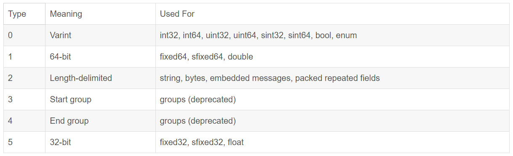
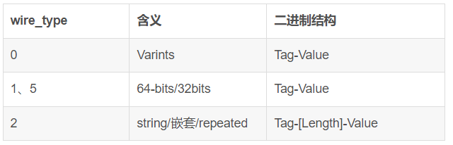
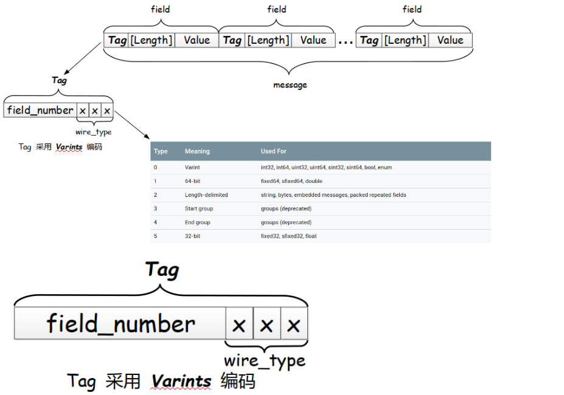

# protobuf知识点

当运行 protocol buffer compiler 编译 test.proto 时，编译器会以您选择的语言生成代码，您需要使用文件中描述的消息类型，包括获取和设置字段值、将消息序列化为输出流，并从输入流解析消息。

对于C++，编译器会根据每个 生成一个.h和.cc文件 .proto，其中包含文件中描述的每种消息类型的类。

`protoc --proto_path=IMPORT_PATH --cpp_out=DST_DIR path/to/file.proto`

- cpp_out生成 C++ 代码存储在DST_DIR
- test.proto 需要编译的proto文件

## protobuf编码基础

### 1. varints
 varints是一种将一个整数序列化为一个或者多个Bytes的方法。越小的整数，使用的Bytes越少。Varints规则如下：
 
- 每个Bytes的最高位(msb)是标志位。如果该值为1，表示该Bytes后面还有其他Byte；如果该位为0，表示该Byte是最后一个Byte。
- 每个Byte的低7位是用来存数值的位。
- 负数编码不能直接使用protobuf编码，需要使用zigzag优化后编码

例子：数值200
    
    在Varints规则，二进制：1100 1000 0000 0001 0001010100111

    第一个字节8位是 1100 1000，最高位是1，后面还有更多字节；第一个字节内容是后7位即100 1000；

    第二个字节8位是 0000 0001，最高位是0，后面没有更多字节；第二个字节内容是后7位即 000 0001；
    小端字节序
    100 1000  000 0001
    地址      低--->高
    000 0001 100 1000      11001000

### 2. 字段编号（field_num）

XXX.proto文件中每个字段的编号

### 3. 传输类型（wire_type）
每个字段都有一个对应的字段(传输)类型，如下表：



### 4. field
message由一个个字段组成，一个字段的完整的二进制描述即<<编号,传输类型>,值>通常称为一个field，如下图。



- 具体而言每个field的构成为Tag-[Length]-Value；这里的[Length]是否需要是依据Tag最后三位的wire_type来决定的。

### 5. Tag：
Tag的组成是 `field_num << 3 | wire_type` (也称为每个filed的key或者键)。

## protobuf 编解码关键点



- 在消息流中每个Tag(key/键)都是varint，编码方式为：field_num << 3 | wire_type。即，Tag(key/键)由 .proto文件中字段的编号(field_num)和传输类型(wire_type)两部分组成。  
**注：Tag也是Varints编码，其后三位是传输类型(wire_type)，之前的数值为是字段编号(field_num)。  
使用Varint编码方式几千/几万的字段序号(field_num)都是可以被表示的。**
- 在对一条消息(message)进行编码的时候是把该消息中所有的 key-value 对序列化成二进制字节流；key和value分别采用不同的编码方式。
- 消息的二进制格式只使用消息字段的字段编号(field_num)作为Tag(key/键)的一部分，字段名和声名类型只能在解析端通过引用参考消息类型的定义(即.proto文件)才能确定。
- 解码的时候解码程序(解码器)读入二进制的字节流，解析出每一个key-value对；如果解码过程中遇到识别不出来的filed_num就直接跳过。这样的机制保证了即使该消息(message)添加了新的字段，也不会影响旧的编/解码程序正常工作。

---

### 1、有符号整数编码的问题与zigzag优化

由上面可以知道protocol buffer中所有与传输类型0关联的类型都会被编码为Varints。但是在编码负数的时候，带符号的int类型(sint32和sint64)与“标准”int类型(int32和int64)之间存在着巨大区别。如果将int32或int64用作负数的类型，则结果varint总是十个字节；也就是说像-1、-2这样的负数也会占用比较多的Bytes。实际上他被视为一个非常大的无符号整数。如果使用有符号类型(sint32和sint64)之一，则生成的varint会采用一种改进的ZigZag编码，效率更高。ZigZag编码将有符号数映射到无符号数以便具有较小绝对值的数字(如-1)也具有较小的varint编码值。这样做的方式是通过正整数和负整数来回“曲折”，将-1编码为1，将1编码为2，将-2编码为3以此类推。

### 2、64-bit(wire_type=1)和32-bit(wire_type=5) 等非varint数字的编码。

这两种的编码方式比较简单，直接在key后面跟上64bits或32bits，采用“小端”字节序。

### 3、Length-delimited(wire_type=2)字符串的编码。

key-value的格式为 key+length+content；key 的编码方式就是前面所说的，length 采用 varints 编码方式，content 就是有 length 指定的长度的 Bytes。

### 4、内嵌消息

内嵌消息会和字符串一样被视为 Length-delimited；编码方式亦相同(key+length+content)。

```C++
message Test1 {
  required int32 a = 1;
}

message Test2 {
  optional Test1 b = 3;
}
```

如果对其实例化一个对象并将 Test1 中的a设置为150，Test2 编码后的二进制流为 “1a 03 08 96 01”。  

1）1a二进制为0001 1010，后三位是010，即传输类型为2(Length-delimited);前五位是11100即3表示序号为3。

2）03就表示后面value的长度为3字节；

3）“08 96 01” 是 Test1 编码后的结果。

## 反射

- 给定一个pb对象，如何自动遍历该对象的所有字段？  
  即是否有一个通用的方法可以遍历任意pb对象的所有字段，而不用关心具体对象类型。
- 反射就是获取系统/程序的元信息。
- 元信息：系统自身描述信息，用于描述系统本身，如字段类型。
- 获取元信息：
    1. .proto 文件
    2. 通过元数据构建proto定义的一些message描述，动态创建出proto的对象，然后把数据赋值给对象。
- 反射的作用：动态获取数据的元数据。

# protobuf嵌入方式

ROS官方：  
Serialization and Adaping Types：https://wiki.ros.org/roscpp/Overview/MessagesSerializationAndAdaptingTypes  
Traits：https://wiki.ros.org/roscpp/Overview/MessagesTraits

## SFINAE

- 编译器先匹配类模板全特化和类模板偏特化，然后再匹配普通模板
- 本质：if else  ,是在编译的时候确定下来的，函数/类，并且只要有一个函数或类匹配成功，就不会编译报错
- SFINAE是C++模板编译的一个原则，全名叫做Substitution Failure Is Not An Error （匹配失败不是错误）

### `std::enable_if`

- If B is true, `std::enable_if` has a public member typedef type, equal to T; otherwise, there is no member typedef.
- 第一个模板参数为 false 的时候并不会有成员变量：type。只有在第一模板参数为 true 的时候才会有定义成员变量：type

### `std::is_base_of`

- std::is_base_of 是 C++ 标准库 <type_traits> 中的一个模板类，用于判断一个类是否是另一个类的基类。
- 两个模版参数
- 有一个成员常量: value，用于表示第一个类型是否是第二个类型的基类。
- 如果第一个类型是第二个类型的基类，value 将为 true，否则为 false。

## 嵌入方法

利用函数模版编译时匹配的特性，给原 rosmsg 的模版加一个参数 enable = void。protobuf 的模板类判断参数类型是否以 protobuf 为基类，不是的话没有第二个 enable 参数，偏特化匹配失败，匹配 rosmsg 模版。匹配顺序，特化 -> 偏特化 -> 普通模版。

```C++
template <typename T, typename Enable = void>
struct Serializer {
    // rosmsg成员
}

// protobuf
template <typename T>
struct Serializer<T, typename std::enable_if<std::is_base_of<::google::protobuf::Message, T>::value>::type> {
    // protobuf成员
}
```

## gdb调试

- bt ：堆栈信息
- gdb a 进程号 ：调试正在运行的进程
- list ：查看堆栈代码
- s ：进入这个函数

---

1. 断点打在 serialization_protobuf.h: 42
2. c ：运行到断点
3. bt ：查看堆栈信息
4. s ：step

## ROS traits

### ROS traits 作用

1. 校验类型：允许在编译时为消息和服务类型添加类型信息，使得在运行时可以对消息类型进行动态的类型检查。
2. 动态反射：可以在运行时获取关于消息的元数据，如protobuf的字段名称、数据类型。可以通过反射机制实现消息的序列化和反序列化，动态地创建、修改和组合消息和服务类型。
3. 消息扩展：消息类型添加截断、压缩、加密等功能。
4. 主要用来适配 C++ types 到ROS的msg types, 同时也方便获取消息的信息，例如：datatype, md5sum和消息定义
5. 所有的traits必需定义在命名空间ros::message_traits

### MessageEvent 类

功能：用于处理消息事件，主要是对message的封装，替换boost::shared_ptr<M const>智能指针