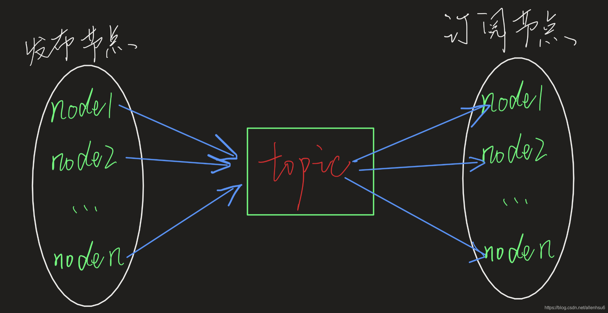

# What is topic?

## 一种一对多、异步的通信机制

## 官方描述
- Topics are named buses over which nodes exchange messages. Topics have anonymous publish/subscribe semantics, which decouples the production of information from its consumption. In general, nodes are not aware of who they are communicating with. Instead, nodes that are interested in data subscribe to the relevant topic; nodes that generate data publish to the relevant topic. There can be multiple publishers and subscribers to a topic.  
Topics are intended for unidirectional, streaming communication. Nodes that need to perform remote procedure calls, i.e. receive a response to a request, should use services instead. There is also the Parameter Server for maintaining small amounts of state.

## message 与topic
- massage是节点之间传递的信息的数据格式。ros支持标准数据类型，同样也支持数据类型的嵌套以及自定义消息类型。ros本身也定义了一整套用于表征机器人的数据格式，包括速度、位姿、轨迹、点云等等。  
- topic是传递信息的名称。无论node是发布者还是订阅者，他们之间相互并不了解，他们在各取所需的时候，寻找的都是topic名称。多个node可以往同一个topic话题上发布信息，同样地，多个node也可以订阅同一个topic。他们的关系如下如所示：

# 1. topic命令行指令

- rostopic pub   
    1. 选择topic后连按tab补全  
    2. -r num 循环pub
- matlab绘图用，Display messages in a matlab/octave-friendly plotting format.Cannot be used with -c.  
    `rostopic echo -p /topic_name`

# 2. 发布话题

- queue size 最大缓存帧数，硬件跟不上会丢弃最早的一帧数据。

# 3. 订阅话题

# 4. 自定义消息类型

## 添加编译规则和描述规则

## 自定义message参考链接
https://blog.csdn.net/allenhsu6/article/details/112334048
