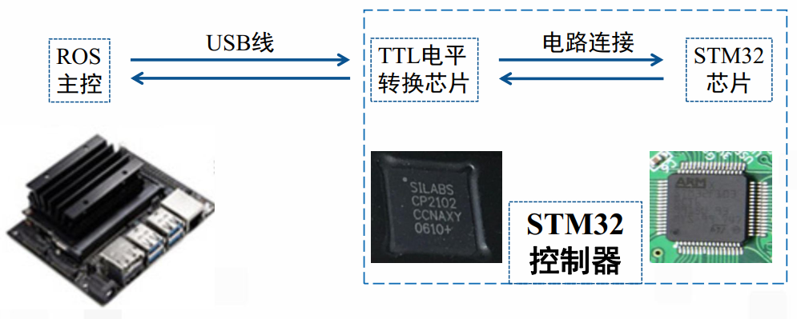
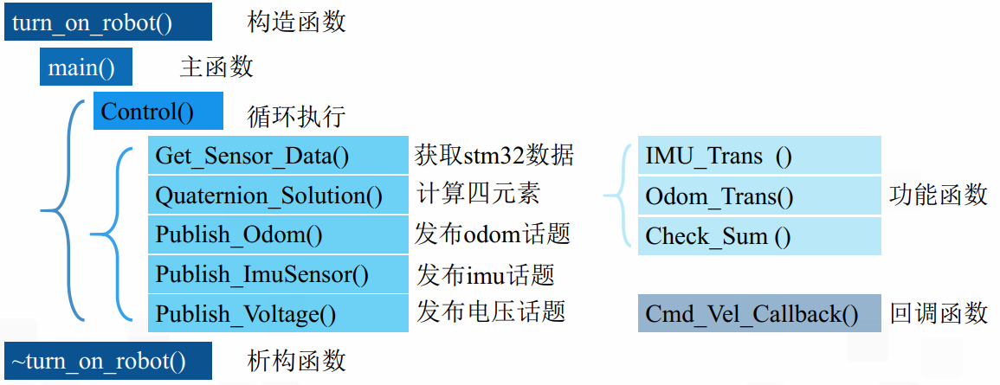

# 1. 两控制器功能

## ROS主控
1. 雷达信息采集
2. 摄像头信息采集
3. 路径规划

## STM32

1. 里程计信息采集（odom）
    - 电机转速
2. 陀螺仪信息采集
    - xyz三轴角速度和三轴加速度
3. 电机控制

## 通讯内容

ROS主控：  
1. 接收：  
    - 里程计信息
    - IMU
    - 电池电压
2. 发送：  
    - 运动底盘目标速度

# 2. 硬件连接

# 3. 软件设置
有两个CP2102芯片：
- ROS和STM32
- ROS和激光雷达

1. 更改CP2102芯片的serial  
    - 区分两个CP2102，有专门的软件
2. 创建设备别名：  
    - 在运行一个ros程序的时候需要提供一个端口名，一般为tty usb，每次插拔对应的端口名都不一样。所以创建设备别名将端口名固定。   
    - 查看端口号命令(LL)：ll /dev/ttyUSB*
    - 定义别名的文件：turn_on_wheeltec_robot/src/wheeltec_udev.sh

# 4. wheeltec_robot.cpp文件

- 注： 回调函数：将机器人的目标速度通过串口发给stm32

1. 串口波特率115200，不建议更高
2. ros::spin()会阻塞等待回调函数  
   ros::spinOnce()不会阻塞
